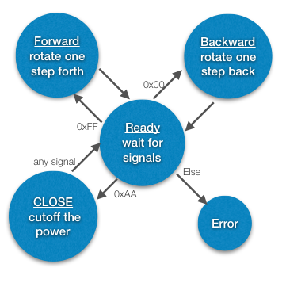
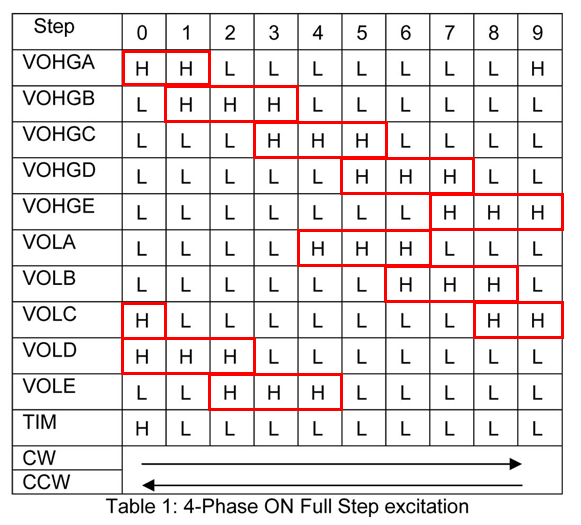

## Stepper_Motor_Control
### `Master_serial_sender.py`
- The program count the waiting time from user specified function and send control messages to the Arduino (`AVR_serial_FSM.c`).
### `AVR_serial_FSM.c`
- It's a Finite State Machine, which receives control messages on a serial port and output corresponding signals base on the true value table, to make the stepper motor rotate in specified ways.
- State Diagram of the Arduino: 
- Configuration of Output Sequences (True Value Table of the Motor): 
